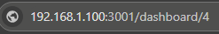

# Desktop-Network-Status-Display

This is a desktop network status display for an arduino. It uses a locally hosted [Uptime Kuma instance](https://github.com/louislam/uptime-kuma) to update the status of the led pixels.

Circuit:
* Ethernet Module attached to pins 10, 50, 51, 52
* LED Pixel Strip attached to pins 3 (minimum 5 pixels)
* Uptime Kuma instance running on a static IP address

## Setup for Uptime Kuma

* Install the Uptime Kuma library by following the instructions on [GitHub](https://github.com/louislam/uptime-kuma).
* Ensure that the Uptime Kuma instance is running on a static IP address, then record the IP address and port number that the instance is running on.
*  Once the instance is running, add some monitors and set the refresh rate on the Uptime Kuma instance.
*  For each monitor, record the monitor number that the Uptime Kuma instance is running on. The monitor number is found in the URL of the monitor's status page. For example, if the monitor's status page is `https://uptime-kuma.com/dashboard/4`, then the monitor number is `4`. 



## Setup for Arduino

*  Once Uptime Kuma is set up, connect the Arduino to the Ethernet Module and the LED Pixel Strip.
*  Once the Arduino is connected to the Ethernet Module, add the IP address and port number that the Uptime Kuma instance is running on to the Arduino.
   *  ```IPAddress serverIP(xxx, xxx, xxx, xxx);```
   *  ```const int serverPort = xxxx; ```
*  Add the monitor numbers you want to monitor from Uptime Kuma to the Arduino. Up to 5 monitors can be monitored in this current version.
   *  ```const String monitorNumbers[] = {"1", "2", "3", "4", "5"};```
*  Add the refresh rate you want to set on the Arduino. The refresh rate is the number of seconds between status updates. The default refresh rate is 30 seconds.
*  Now the code is ready to be uploaded to the Arduino, and the Arduino will start displaying the status of the monitors in the LED strip.


